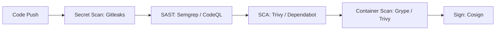

# CI/CD Security: SAST, DAST & SCA Pipeline Integration

Embedding automated security checks directly into GitHub Actions and GitLab CI.

---

## 1. Multi-Stage Pipeline Stages



---

## 2. GitHub Actions Security Template (`.github/workflows/security.yml`)

```yaml
name: Security Pipeline

on: [push, pull_request]

jobs:
  secret-scan:
    runs-on: ubuntu-latest
    steps:
      - uses: actions/checkout@v4
        with:
          fetch-depth: 0
      - name: Gitleaks Scan
        uses: gitleaks/gitleaks-action@v2

  sast-scan:
    runs-on: ubuntu-latest
    steps:
      - uses: actions/checkout@v4
      - name: Semgrep SAST
        uses: returntocorp/semgrep-action@v1
        with:
          config: >-
            p/security-audit
            p/secrets
            p/ci
```
