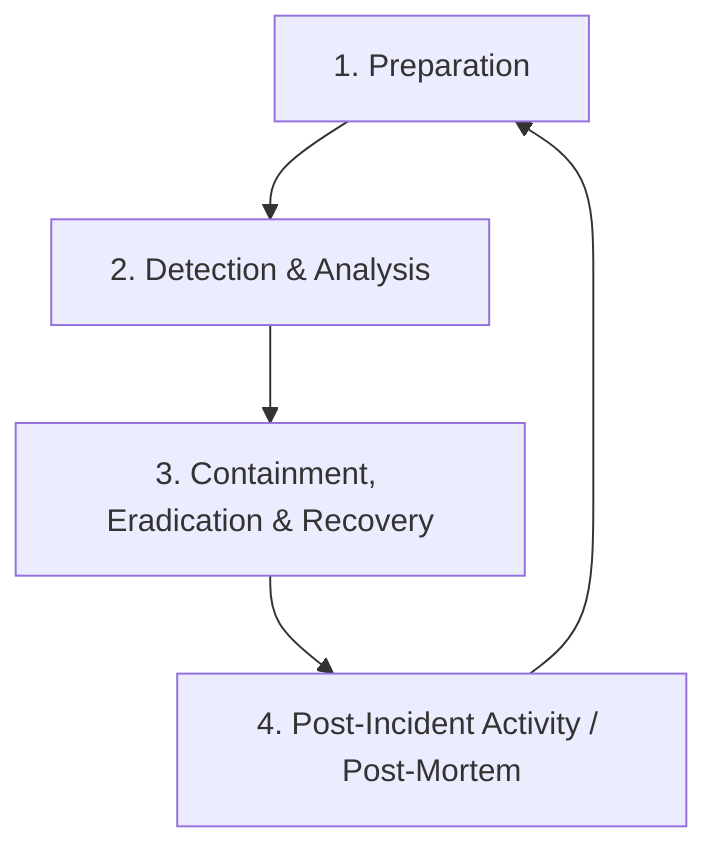

# Incident Response & Post-Mortem Playbook

Step-by-step operational checklist for handling security incidents and outages.

---

## 1. Incident Response Lifecycle (NIST SP 800-61)



---

## 2. Blameless Post-Mortem Template

```markdown
# Incident Post-Mortem: [Incident Name]
**Date**: YYYY-MM-DD  
**Severity**: P1 / P2 / P3  
**Authors**: [Team]

### Summary
Brief description of what happened, customer impact, and duration.

### Root Cause
Detailed technical explanation of the failure mode.

### Timeline (UTC)
- HH:MM - First detection / Alert fired
- HH:MM - Team assembled
- HH:MM - Mitigation applied
- HH:MM - Service restored

### Action Items
- [ ] [Preventative Action] (Owner: Name, Due: Date)
- [ ] [Monitoring Improvement] (Owner: Name, Due: Date)
```
